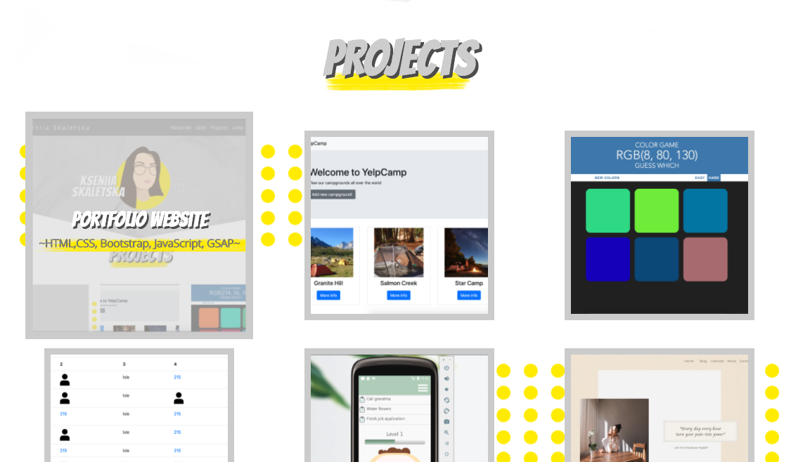
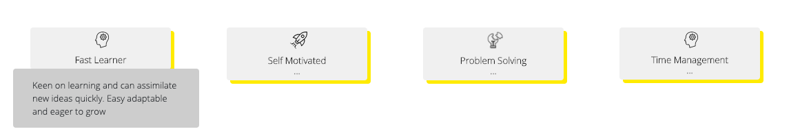
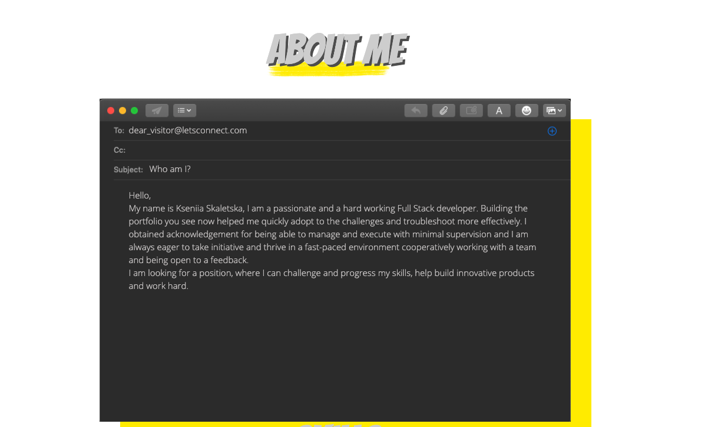
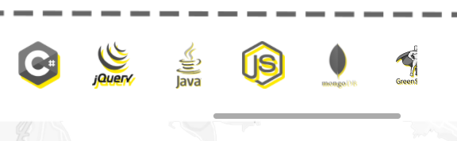
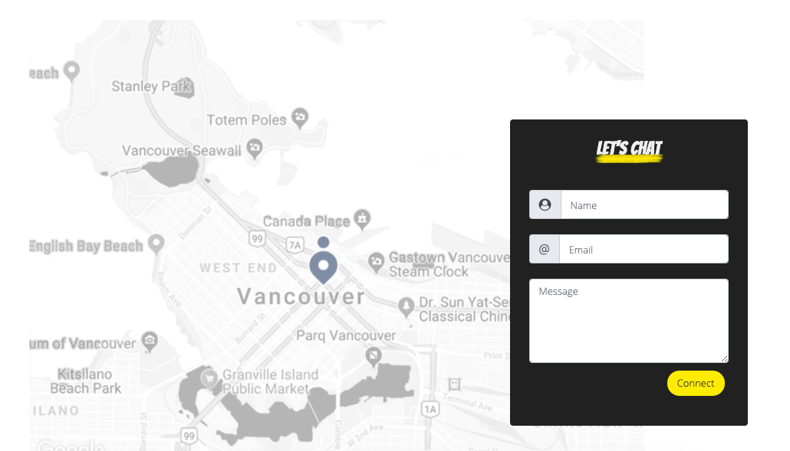

# Portfolio Website
Published: https://kseniask.github.io/portfolio_cv/ 

Website build with HTML,CSS, Bootstrap 4, GSAP, JavaScript and jQuery 
To catch the item being on the screen for animations, I used the library jquery.visible.

## Demo

### **Projects**

On launch the smooth nav bar and job title animation plays.

After scrolling lower, the projects' boxes are animated. The animation is attached to the event when the page appears on the screen.

On hover event the title of the project and used technologies change their oppacity to 1.At the same time, the project box is animated using GSAP to change its size. The image is clickable, so the user can be transferred to the Github repository.

 

### **Personal Skills**

Below the project section, there are boxes with personal skills. Caught hover event shows the skill description.

 

### **About Me**

This section describes my personality and has a small animation which deletes phrase "have fun" and types "work hard" instead at the end of the message. This animation starts every time when user reaches this section.

 

### **Technical Skills**

This is a scrollable section, which illustrates my technical skills. It has the animation which makes icons big in a sequence. Having the pointer in this section allows user to scroll right or left and check all present skills.

 

### **Contact Me Form**

It allows users to write a message. It will come to my email and user's name and email will be mentioned in there. The smtp plugin is used to enable the email function.

The website is 100% responsive and looks appropriate on every device
